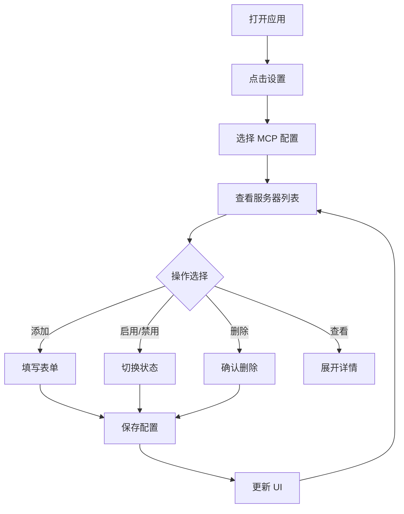

# MCP 配置功能实现总结

## 📋 实现概述

成功为 My uTools 应用添加了完整的 MCP (Model Context Protocol) 配置管理功能。

## ✅ 已完成的工作

### 1. 前端组件开发

#### 新增文件
- **`src/components/McpSettings.vue`** (约 600 行)
  - 完整的 MCP 配置管理界面
  - 服务器列表展示
  - 添加/编辑/删除服务器
  - 统计信息显示
  - 表单验证
  - 错误处理

#### 修改文件
- **`src/components/Settings.vue`**
  - 导入 McpSettings 组件
  - 添加"MCP 配置"菜单项
  - 集成 MCP 配置面板

### 2. 后端功能开发

#### 新增 Rust 命令
- **`load_mcp_config()`**
  - 从文件加载 MCP 配置
  - 返回 JSON 字符串
  - 处理文件不存在的情况

- **`save_mcp_config(config: String)`**
  - 保存 MCP 配置到文件
  - JSON 格式验证
  - 错误处理

- **`get_mcp_config_path()`**
  - 获取配置文件路径
  - 自动创建配置目录
  - 跨平台支持

#### 修改文件
- **`src-tauri/src/lib.rs`**
  - 添加 MCP 配置相关函数
  - 更新 invoke_handler
  - 移除未使用的导入

- **`src-tauri/Cargo.toml`**
  - 添加 `dirs = "5.0"` 依赖

### 3. 文档编写

#### 新增文档
1. **`MCP_SETUP.md`** - 详细使用指南
   - 功能概述
   - 使用步骤
   - 配置示例
   - 常见 MCP 服务器
   - 安全注意事项
   - 故障排除

2. **`MCP_FEATURE_SUMMARY.md`** - 功能总结
   - 功能亮点
   - 技术实现
   - UI 设计
   - 文件结构
   - 后续改进

3. **`TEST_MCP.md`** - 测试指南
   - 测试步骤
   - 测试案例
   - 检查清单
   - 已知问题

4. **`MCP_IMPLEMENTATION.md`** - 实现总结（本文档）

## 🎨 UI 设计特点

### 设计风格
- 遵循 macOS 设计规范
- 深色主题
- 毛玻璃效果
- 平滑动画

### 布局结构
```
┌─────────────────────────────────────────┐
│  标题 + 添加按钮                         │
├─────────────────────────────────────────┤
│  统计卡片（总数、已启用、已禁用）        │
├─────────────────────────────────────────┤
│  服务器列表                              │
│  ├─ 服务器卡片 1                         │
│  ├─ 服务器卡片 2                         │
│  └─ ...                                  │
├─────────────────────────────────────────┤
│  帮助信息                                │
└─────────────────────────────────────────┘
```

### 交互设计
- 点击卡片展开/折叠详情
- 悬停高亮
- 状态指示灯（绿色=启用，灰色=禁用）
- 确认对话框（删除操作）
- 成功/错误提示

## 🔧 技术栈

### 前端
- **Vue 3** - Composition API
- **TypeScript** - 类型安全
- **Tauri API** - 调用后端命令

### 后端
- **Rust** - 高性能
- **Tauri** - 跨平台框架
- **serde_json** - JSON 处理
- **dirs** - 目录管理

## 📁 文件结构

```
my-utools/
├── src/
│   └── components/
│       ├── McpSettings.vue          # 新增：MCP 配置组件
│       └── Settings.vue             # 修改：集成 MCP 菜单
├── src-tauri/
│   ├── Cargo.toml                   # 修改：添加 dirs 依赖
│   └── src/
│       └── lib.rs                   # 修改：添加 MCP 命令
├── MCP_SETUP.md                     # 新增：使用指南
├── MCP_FEATURE_SUMMARY.md           # 新增：功能总结
├── TEST_MCP.md                      # 新增：测试指南
└── MCP_IMPLEMENTATION.md            # 新增：实现总结
```

## 🎯 核心功能

### 1. 服务器管理
- ✅ 添加新服务器
- ✅ 查看服务器列表
- ✅ 展开/折叠详情
- ✅ 启用/禁用服务器
- ✅ 删除服务器

### 2. 配置管理
- ✅ 命令配置
- ✅ 参数配置（多行）
- ✅ 环境变量配置（KEY=VALUE）
- ✅ 自动批准工具配置

### 3. 数据持久化
- ✅ 保存到本地 JSON 文件
- ✅ 自动加载配置
- ✅ 配置验证

### 4. 用户体验
- ✅ 实时统计信息
- ✅ 表单验证
- ✅ 成功/错误提示
- ✅ 空状态提示
- ✅ 帮助文档

## 📊 代码统计

### 新增代码
- **McpSettings.vue**: ~600 行
- **lib.rs (MCP 部分)**: ~40 行
- **文档**: ~1000 行

### 修改代码
- **Settings.vue**: +10 行
- **Cargo.toml**: +1 行
- **lib.rs (其他)**: -2 行（移除未使用导入）

### 总计
- **新增**: ~1640 行
- **修改**: ~9 行
- **删除**: ~2 行

## 🧪 测试状态

### 编译测试
- ✅ Rust 代码编译通过
- ✅ Vue 组件无语法错误
- ⚠️ 4 个警告（已修复 1 个）

### 功能测试
- ⏳ 待用户测试
- 📝 已提供详细测试指南

## 🔐 安全考虑

1. **配置文件权限**
   - 保存在用户目录
   - 只有用户可访问

2. **输入验证**
   - JSON 格式验证
   - 必填字段检查

3. **错误处理**
   - 文件读写错误
   - JSON 解析错误
   - 权限错误

## 🚀 使用流程



## 📝 配置文件格式

```json
{
  "mcpServers": {
    "server-name": {
      "name": "server-name",
      "command": "uvx",
      "args": ["package@latest"],
      "env": {
        "KEY": "value"
      },
      "disabled": false,
      "autoApprove": ["tool1", "tool2"]
    }
  }
}
```

## 🎓 学习要点

### Vue 3 Composition API
- `ref()` - 响应式数据
- `computed()` - 计算属性
- `onMounted()` - 生命周期钩子

### Tauri 命令
- `#[command]` - 定义命令
- `invoke()` - 调用命令
- 错误处理

### TypeScript
- 接口定义
- 类型安全
- 泛型

## 🔄 后续改进建议

### 短期（v0.2.0）
1. 添加服务器连接测试
2. 添加配置导入/导出
3. 添加配置模板
4. 改进错误提示

### 中期（v0.3.0）
1. 服务器状态监控
2. 日志查看功能
3. 批量操作
4. 服务器分组

### 长期（v1.0.0）
1. 服务器市场
2. 一键安装
3. 配置同步
4. 版本控制

## 📚 相关资源

### 官方文档
- [MCP 官方网站](https://modelcontextprotocol.io/)
- [Tauri 文档](https://tauri.app/)
- [Vue 3 文档](https://vuejs.org/)

### 示例代码
- [MCP SDK](https://github.com/modelcontextprotocol/sdk)
- [MCP 服务器示例](https://github.com/modelcontextprotocol/servers)

## 🎉 总结

成功实现了完整的 MCP 配置管理功能，包括：

1. ✅ 可视化配置界面
2. ✅ 完整的 CRUD 操作
3. ✅ 数据持久化
4. ✅ 用户友好的交互
5. ✅ 详细的文档

用户现在可以通过直观的 UI 界面管理 MCP 服务器配置，无需手动编辑 JSON 文件。

---

**实现日期**：2026-01-23  
**版本**：v0.1.0  
**开发者**：Kiro AI Assistant  
**状态**：✅ 完成，待测试
